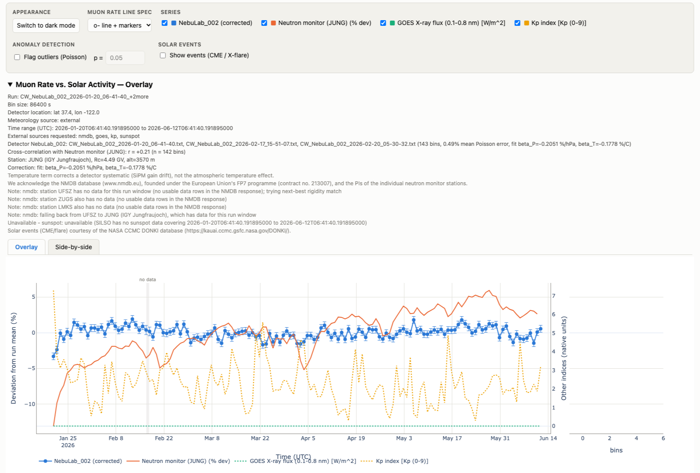

# Muon Rate vs. Solar Activity

Turns a CosmicWatch v3X data file into a pressure/temperature-corrected muon
rate and compares it against public solar-activity data on interactive plots.

## Live demo

A page generated by this tool from a real three-file `NebuLab_002` run is
published at **<https://nebula0030.github.io/gcr_solar_modulation/>** — not a
screenshot, the actual output, with the tabs, series toggles, theme switch and
event markers all live.

[](https://nebula0030.github.io/gcr_solar_modulation/)

143 daily bins spanning 2026-01-20 to 2026-06-12 UTC, corrected with a fitted
`beta_P` of -0.2051 %/hPa and compared against the JUNG (Jungfraujoch) neutron
monitor, GOES X-ray flux and the Kp index. The gray band is a coverage gap
between two of the input files.

## Setup

```bash
/usr/bin/python3 -m venv .venv
.venv/bin/pip install -r requirements.txt
```

Requires Python 3.9+.

## Usage

```bash
.venv/bin/python process_data.py DATA_FILE --bin-length SECONDS [options]
```

Example:

```bash
.venv/bin/python process_data.py ../CW_NebuLab_004_2026-07-10_04-16-31.txt \
  --bin-length 3600 --export-csv
```

This writes a single combined `<run>.html` with an Overlay tab (active on
load) and a Side-by-side tab, sharing one control bar (per-series checkboxes,
theme, line style) that drives both figures — switching tabs just shows the
other figure and resizes it, without a full page reload.

Because `<run>.html` is written with the same name prefix as the input file
(by default, alongside it), scripts that later glob the data directory for
inputs should use a `.txt`-qualified pattern (`CW_*.txt`), not a bare `CW_*`,
so the generated `.html` isn't swept up as if it were data. Alternatively,
pass `--output-dir` to write all generated HTML somewhere separate from the
inputs.

On a real ~2.74-day run from this detector (747,823 events parsed, 111,538
of them coincident, mean coincident rate ~0.47 Hz) with 1-hour bins, this
produced 65 complete bins, a mean Poisson error of 2.43% per bin, and a
fitted `beta_P` of -0.54 +/- 0.49 %/hPa — flagged with a narrow-pressure-range
warning because the run's barometric pressure only spanned 2.6 hPa. All four
external sources (NMDB, GOES, Kp, sunspot number) were retrieved successfully
for that run.

## Multiple files and detectors

More than one file can be passed on the command line:

```bash
.venv/bin/python process_data.py file1.txt file2.txt [...] --bin-length SECONDS [options]
```

Each file is grouped by the detector name in its `Name` column (column 11
of the v3X format) — not by filename. The majority `Name` value among a
file's rows decides which detector it belongs to; a minority of
differently-named rows in the same file is reported as a warning, not an
error.

**Same detector, multiple files: splicing.** Files that share a detector
`Name` are spliced onto one absolute time axis, for a run that was
interrupted and resumed. Verified by re-running a real ~2.74-day
`NebuLab_004` file alongside a second copy of itself given a synthetic
start three days after the first ends:

```bash
.venv/bin/python process_data.py \
  CW_NebuLab_004_2026-07-10_04-16-31.txt part2.txt \
  --start-time part2.txt=2026-07-15T00:00:00Z \
  --bin-length 3600 --correction-method literature --beta-p -0.13
```

The console reported one detector (`NebuLab_004`), listed both input
files, 181 complete 1-hour bins spanning 2026-07-10 04:16 to 2026-07-17
17:16 UTC, and wrote one combined `<run>.html` (the run name grows a
`+1more` suffix once more than one file contributes). With
`--export-csv`, the gap between the files' coverage — 2026-07-12T22:16 to
2026-07-14T23:16 in this run — showed up as 49 consecutive bins with
`counts=0`, `livetime_s=0`, and `nan` rate/error/pressure/temperature
columns.

On the plots, the gap is visible as a break in the line (no point is
drawn for a NaN bin) and as a shaded gray band with a "no data" label
spanning the gap region, confirmed by a headless-Chrome render of the
real gap output above.

**`--start-time FILE=DATETIME`** overrides one file's start time; repeat
the flag once per file that needs it. `FILE` matches by basename (not
full path); `DATETIME` is ISO-8601 UTC, e.g. `2026-07-15T00:00:00Z`. This
is needed because the detector's `Timestamp[s]` column is seconds since
power-on, not wall-clock time, so a multi-file splice has no way to know
the true gap (or overlap) between files without it.

**Same detector, overlapping time ranges: an error.** If two files
resolve to the same detector `Name` and their absolute time spans
overlap, the tool refuses to splice them and exits nonzero rather than
silently double-counting events:

```
error: files 'a.txt' and 'b.txt' overlap in time by 237014.3 s; fix their clocks or drop one
```

Confirmed with exit code 2 on a real run (the same file passed in
twice). Use `--start-time` if the files are genuinely sequential and
just need their clocks corrected, or drop one file if they're
duplicates.

**Different detectors stack on one page.** Files whose `Name` columns
differ are *not* spliced; each is treated as its own detector and all
detectors are plotted together against one shared external-data fetch
(one NMDB station, one GOES/Kp/sunspot pull, covering the union of every
detector's time span). Verified with the reference file alongside a
truncated, relabeled copy (first 50,000 lines, `Name` rewritten to
`AxLab_test`):

```bash
.venv/bin/python process_data.py \
  CW_NebuLab_004_2026-07-10_04-16-31.txt axlab_test.txt \
  --bin-length 3600 --correction-method literature --beta-p -0.13
```

The console printed one full summary block per detector (`=== detector
NebuLab_004 ===`, `=== detector AxLab_test ===`), each with its own
event count, bin count, and fitted/supplied correction. The two
detectors overlap in absolute time (`AxLab_test` covers the first ~4.5
hours of `NebuLab_004`'s 65-hour run) and that is allowed — the
same-detector overlap check only applies within one detector's `Name`.
The Overlay tab rendered one percent-deviation trace per detector (two
distinct colors, confirmed by screenshot, one legend entry and checkbox
each); the Side-by-side tab puts both detectors' traces in a single
shared rate panel, with one additional panel per external source. Both
tabs live in the same `<run>.html` and share the one control bar.
Per-detector binned CSVs are exported with the detector name appended,
e.g. `..._NebuLab_004_binned.csv` and `..._AxLab_test_binned.csv`. Gap
shading only applies when there is exactly one detector — with two or
more, no gap bands are drawn even if an individual detector's coverage
has an internal gap, since per-detector spans are expected to differ
and shading all of them would just clutter the page.

A single file behaves exactly as it always has — everything above is
additive.

## How it works

1. **Parse.** Reads the 13-column v3X format. Timestamps are treated as UTC.
2. **Bin.** Counts only coincident (`Flag == 1`) events. Livetime per bin is
   the bin width minus the increase in the detector's cumulative deadtime
   counter.
3. **Correct.** Applies `R_corr = R * exp(-beta_P*(P-P0) - beta_T*(T-T0))`,
   with coefficients either fitted from the run or supplied.
4. **Fetch.** Pulls NMDB neutron monitor counts, GOES X-ray flux, Kp index,
   and sunspot number for the run's window, cached locally.
5. **Align.** Resamples everything onto the rate bins, flagging interpolated
   points.
6. **Plot.** Emits one combined `<run>.html` with an Overlay tab and a
   linked-axis Side-by-side tab, sharing one control bar.

## Choosing a bin length

Poisson error per bin at ~0.47 Hz:

| Bin length | Fractional error |
| --- | --- |
| 1 hour | 2.4% |
| 6 hours | 1.0% |
| 24 hours | 0.5% |

These are the values actually measured on a real run: 65 complete 1-hour
bins gave a mean per-bin error of 2.43%, and 10 complete 6-hour bins gave
0.99%. The 24-hour figure follows the same 1/sqrt(t) scaling.

Solar modulation in ground-level muon rate is typically 0.5-3%, so bins
shorter than about an hour bury the signal in counting noise.

## Two things to be aware of

**The temperature correction is a detector systematic, not the atmospheric
temperature effect.** The onboard BMP280 measures enclosure temperature,
which tracks SiPM gain drift and therefore the effective trigger threshold.
The classical atmospheric temperature effect depends on upper-air
temperature at the pion-production altitude and is not corrected here.

**`--correction-method literature` has no default coefficient.** No
verifiable CosmicWatch-specific published barometric coefficient was found,
so you must pass `--beta-p` explicitly and are encouraged to record where it
came from via `--beta-p-source`. Use `--correction-method fit` on a long run
to derive your own.

## Station selection

The comparison neutron monitor is chosen by matching geomagnetic cutoff
rigidity, not geographic distance, because rigidity governs which primaries
reach a location and therefore the size of solar modulation signals. Note
that this tends to favour high-altitude mountain stations; override with
`--nmdb-station` for a sea-level comparison.

The rigidity-best match is not always the station that gets used: NMDB does
not have data for every station at every moment, and coverage gaps are
common for the small, high-altitude stations that rigidity matching tends
to favour. If the top-ranked station has no usable data for the run's
window, the tool automatically tries the next-best rigidity match, and the
next, exhausting the full ranking if needed, until it finds a station that
actually has data. Each station it rules out is reported as a `NOTE` in the
console summary (e.g. "station UFSZ has no data for this run window ...
trying next-best rigidity match"), along with which station it ultimately
fell back to. This fallback is expected behaviour, not a failure — but it
means the exact station used can vary run to run as NMDB's live data
coverage changes, even for the same detector location and the same
requested bin length.

## Options

Run `.venv/bin/python process_data.py --help` for the full list.

## Solar events (CME / X-flare markers)

By default the tool fetches Earth-directed CME arrivals and X-class solar flares
for the run's time window from NASA's DONKI database and draws each as a dotted
vertical line. Pass `--no-events` to skip that fetch. Set `NASA_API_KEY` for a
higher rate limit (otherwise `DEMO_KEY` is used).

On the page, a **Show events** checkbox (unchecked by default) toggles the lines
in both tabs. Where events cluster, only the most significant one per group is
labelled (with `+N` for the rest); hover a label to list every event it stands
in for.

## Data sources

- Neutron monitors: [NMDB](https://www.nmdb.eu/)
- X-ray flux: [NOAA SWPC](https://services.swpc.noaa.gov/) and
  [NOAA NCEI](https://www.ngdc.noaa.gov/)
- Kp index: [GFZ Potsdam](https://kp.gfz.de/)
- Sunspot number: [SILSO, Royal Observatory of Belgium](https://www.sidc.be/SILSO/)
- Solar events (CME/flare): [NASA CCMC DONKI](https://kauai.ccmc.gsfc.nasa.gov/DONKI/)

We acknowledge the NMDB database (www.nmdb.eu), founded under the European
Union's FP7 programme (contract no. 213007), and the PIs of the individual
neutron monitor stations.
